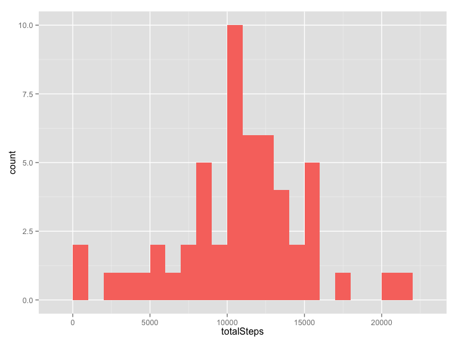
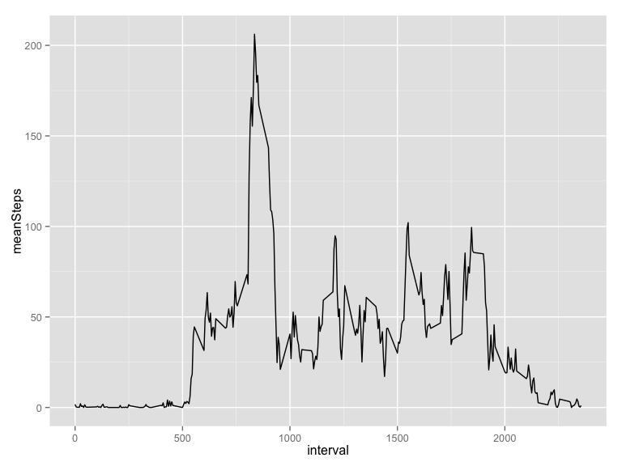
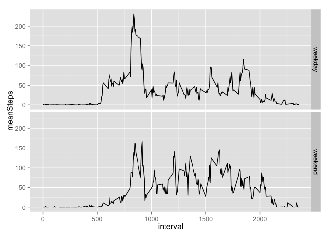

# Reproducible Research: Peer Assessment 1


## Loading and preprocessing the data

First we load appropriate libraries, set some options, then unzip and load the data:


```r
suppressWarnings(suppressMessages(library(dplyr)))
suppressWarnings(suppressMessages(library(ggplot2)))
options(scipen=999) # Get numbers to print nicely...

unzip('activity.zip')
data = read.csv('activity.csv', stringsAsFactors = F)
```

## What is mean total number of steps taken per day?

The following code computes total steps taken per day:


```r
stepsPerDay = data %>% # Start with the data we loaded
  filter(!is.na(steps)) %>% # Remove entries with NA steps
  group_by(date) %>% # Group into days
  summarise(totalSteps = sum(steps))  #Find total steps each day
```

Then we plot a histogram.


```r
ggplot() + geom_histogram(data = stepsPerDay, aes(x = totalSteps, fill = 'coral'), binwidth = 1000 ) + theme(legend.position="none")
```

 


```r
meanStepsPerDay = mean(stepsPerDay$totalSteps)
print(meanStepsPerDay)
```

```
## [1] 10766.19
```

```r
medianStepsPerDay = median(stepsPerDay$totalSteps)
```

So the mean total number of steps taken per day is 10766.1886792, and the median is 10765. 

## What is the average daily activity pattern?

The following code computes average steps taken in each 5 minute interval:


```r
stepsPerInterval = data %>% # Start with the data we loaded
  filter(!is.na(steps)) %>% # Remove entries with NA steps
  group_by(interval) %>% # Group into days
  summarise(meanSteps = mean(steps))  #Find mean steps each interval
```

Plot a time series plot of steps


```r
ggplot() + geom_line(data = stepsPerInterval, aes(x = interval, y = meanSteps), binwidth = 1000 ) + theme(legend.position="none")
```

 

And find the maximum.


```r
maxIntervalStart = stepsPerInterval$interval[which.max(stepsPerInterval$meanSteps)]
```

The interval with the most steps on average is from 835 to 840 minutes.

## Imputing missing values


```r
numberOfNas = sum(is.na(data$steps))
```
Of the 17568 rows in the data, 2304 are *NA* (13.11% of rows).

To replace these *NA*s, we will use the simple strategy of replacing them with the mean number of steps for that 5 minute interval, which we computed in the previous section. Then create a new data set replacing *NA*s with the mean for each interval.


```r
imputedData = data

stepsPerInterval = as.matrix(stepsPerInterval)
rownames(stepsPerInterval) = stepsPerInterval[,'interval']

imputedData$steps[is.na(imputedData$steps)] = stepsPerInterval[as.character(imputedData$interval[is.na(imputedData$steps)]),2]
```


## Are there differences in activity patterns between weekdays and weekends?

First we add the weekday/weekend factor and compute means by factor:

```r
imputedData$week = as.factor( 
  ifelse(
    weekdays(as.Date(imputedData$date)) %in% c("Saturday","Sunday"),
    "weekend", "weekday"
  ))

weekendMeans = imputedData %>% 
  filter(!is.na(steps)) %>% # Remove entries with NA steps
  group_by(week, interval) %>% # Group into weekend/day
  summarise(meanSteps = mean(steps))  #Find mean steps each interval
```

Then plot:

```r
ggplot() + geom_line(data = weekendMeans, aes(x = interval, y = meanSteps), binwidth = 1000 ) + facet_grid(week ~ .)
```

 
